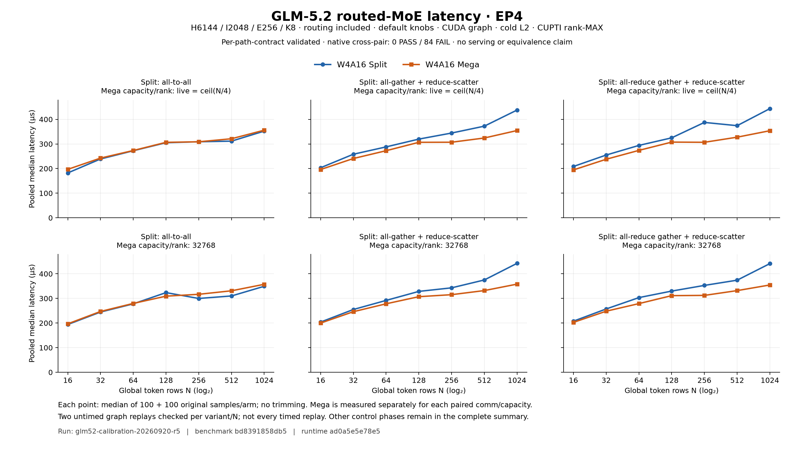
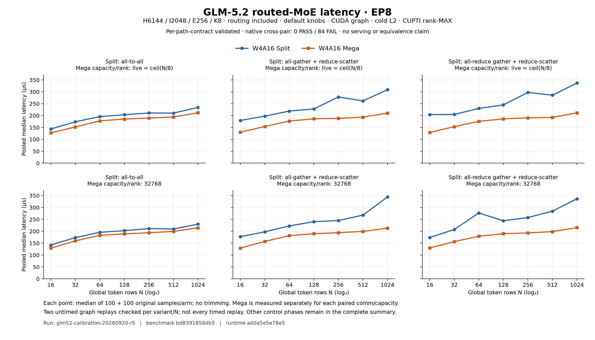

# GLM-5.2 routed-MoE 校准结果

[English](README.md)

**FINAL：60/60 jobs，110/110 完整配对组；每组每 arm 合并 200 个样本，共 44,000 个性能样本。** 原始8-job正确性阶段的192个CUDA-event样本仅作诊断，未计入性能。

独立 per-path 数学/归约契约和请求的图重放检查通过，`atol=rtol=0.01` 不变。原 native cross-pair 结果仍为 8 PASS / 244 FAIL；不得把 per-path 通过解释为跨后端等价。

## 结果与完整原始数据

[完整110组配对表](PAIRED_TABLES_zh.md) · [严格原始汇总](summary/summary.md) · [未舍入JSON](summary/summary.json) · [CSV](summary/paired_latency.csv) · [全部60份原始日志与tactics](RAW_LOGS.md) · [图与指标SHA](figures/figure_manifest.json)

下表统计每个phase/EP/通信组合的观测点；范围不是置信区间，不跨组或样本池计算合并速度比。负Δ表示Mega延迟较低。

全部110组：Mega延迟较低96组、较高14组；9组在两次repeat之间变号。仅统计观测方向，不是跨工作负载合并收益。

| 阶段 | EP | Split通信 | 组数 | Mega较低/较高/相同 | Mega延迟Δ范围 % | 两repeat方向反转 |
|---|---:|---|---:|---:|---:|---:|
| core | 4 | alltoall | 14 | 2/12/0 | -4.4553 to +7.9806 | 7 |
| core | 4 | allgather | 14 | 14/0/0 | -19.0825 to -1.9930 | 0 |
| core | 4 | allreduce | 14 | 14/0/0 | -20.8357 to -2.3433 | 0 |
| core | 8 | alltoall | 14 | 14/0/0 | -12.5557 to -4.7531 | 0 |
| core | 8 | allgather | 14 | 14/0/0 | -38.0766 to -18.2153 | 0 |
| core | 8 | allreduce | 14 | 14/0/0 | -37.2434 to -22.2058 | 0 |
| auto | 4 | allgather | 3 | 3/0/0 | -21.3732 to -7.6770 | 0 |
| auto | 8 | allgather | 3 | 3/0/0 | -34.4618 to -25.6725 | 0 |
| routing | 4 | allgather | 3 | 2/1/0 | -17.7735 to +1.3186 | 1 |
| routing | 4 | allreduce | 3 | 3/0/0 | -17.3226 to -2.3685 | 0 |
| routing | 8 | allgather | 3 | 3/0/0 | -28.8034 to -13.2262 | 0 |
| routing | 8 | allreduce | 3 | 3/0/0 | -34.3117 to -19.2901 | 0 |
| prefill | 4 | allgather | 2 | 1/1/0 | -5.0665 to +4.6656 | 0 |
| prefill | 4 | allreduce | 2 | 2/0/0 | -7.8798 to -1.2987 | 1 |
| prefill | 8 | allgather | 2 | 2/0/0 | -10.3969 to -4.3755 | 0 |
| prefill | 8 | allreduce | 2 | 2/0/0 | -12.3896 to -6.3116 | 0 |

**Eager prefill：Mega在8点中7点延迟较低、1点较高。较高点：EP4/allgather N16384: +4.6656%。** 这些大N点使用default Mega knobs，不是AUTO结果。


## AUTO / routing 控制与跨invocation漂移

与同EP/通信/容量/N的default core比较，两列都保留。AUTO行的Split控制没有更换算法；其跨invocation漂移限制了纯调优收益的归因。routing行两arm都改成precomputed routing。以下不是同一进程内因果消融，也没有计算跨行平均收益。

| 控制 | EP | Comm | N | Mega相对default Δ% | Split控制相对default Δ% |
|---|---:|---|---:|---:|---:|
| auto | 4 | allgather | 16 | -12.7923 | +0.1331 |
| auto | 4 | allgather | 128 | -5.6955 | -4.5247 |
| auto | 4 | allgather | 1024 | -7.1098 | -4.4034 |
| auto | 8 | allgather | 16 | -7.1986 | -9.1015 |
| auto | 8 | allgather | 128 | -8.6653 | +5.3641 |
| auto | 8 | allgather | 1024 | -6.5257 | -11.6814 |
| routing | 4 | allgather | 16 | -2.2177 | -5.4137 |
| routing | 4 | allgather | 128 | +0.0990 | -6.0927 |
| routing | 4 | allgather | 1024 | -1.1488 | -2.7223 |
| routing | 4 | allreduce | 16 | -3.4812 | -3.1141 |
| routing | 4 | allreduce | 128 | -1.6914 | -4.9675 |
| routing | 4 | allreduce | 1024 | +0.2529 | -2.5806 |
| routing | 8 | allgather | 16 | -3.2090 | -12.9619 |
| routing | 8 | allgather | 128 | -1.6691 | -10.5414 |
| routing | 8 | allgather | 1024 | -1.5242 | -14.3505 |
| routing | 8 | allreduce | 16 | -3.4240 | -9.7911 |
| routing | 8 | allreduce | 128 | -2.9139 | -6.4211 |
| routing | 8 | allreduce | 1024 | -3.0251 | -5.6118 |





## 口径与限制

- 每个arm的`latency_us = 1000 × median(r1.samples_ms + r2.samples_ms)`，100+100样本不裁剪；每个样本为rank-MAX。速度比为Split/Mega，带符号变化为`100×(Mega/Split−1)`。每种EP/通信/容量/N/knobs/routing/graph设置独立配对，Mega不跨通信复用。
- 图仅展示84个core组：default knobs、routing included、CUDA graph、CUPTI、cold L2。auto为6组独立tuning，routing为12组precomputed控制，prefill为8组eager N4096/16384；完整表保留全部110组。
- 这是合成H6144/I2048/E256/K8/group1 routed-MoE，随机输入，不是checkpoint replay；没有attention/shared expert/router GEMM/MTP。横轴是全局token行数，不是请求数；延迟不是serving吞吐、TPOT或交互性，不能证明原serving性能差异的因果。
- 两次额外的untimed poisoned-output图重放被检查，而不是所有timed replay；cuBLASLt和规定的NCCL原语仍是可信边界。r5原始input tensors未保存。两repeat不能建立统计显著性，跨repeat反转明确保留。
- 调优范围：[固定版本源码与16份serving日志审查](proofs/serving-autotune-coverage-review.md)确认Split全部启动了调优，但普通EAGLE明确跳过额外EXTEND pass，无法证明大prefill专门调优。Serving Mega使用独立None路径，不是auto。r5 Split各invocation显式按最大N调优；Mega AUTO仅覆盖graph N16/128/1024，eager大N仍default。不得声称prefill Mega已autotuned或据此归因serving。
- r3/d1原始strict FAIL未被改判；其完整tensor诊断已单独发布，本包不重复复制。缓存归档和节点清理属于独立流程；本包不声称已归档或已清理。

## 环境、源码与复算

- Benchmark `bd8391858db504c8997e704c7952f4d48ccab591`; runtime/kernel `ad0a5e5e78e57070ec7c582efe733cb55cd8839f`; lmsysorg/sglang:nightly-dev-cu13-20260918-20518d85.
- NVIDIA B300, EP4/EP8; Torch `2.13.0+cu130`, CUDA `13.0`, CuTe `4.7.1`, CUPTI `13.2.0` / `13.2.86`, loaded NCCL `2.29.7`.
- [Exact argv/env/source/runtime](evidence/runs/glm52-calibration-20260920-r5/provenance.json) · [60-job plan](evidence/runs/glm52-calibration-20260920-r5/plan.json) · [Correctness seal](evidence/runs/glm52-calibration-20260920-r5/gate-receipt.json) · [Completion](evidence/runs/glm52-calibration-20260920-r5/exit.json).
- [12 setup receipts](environment/verification.json) · [Actual 12-test component gate](component-gate/verification.json) · [Unmodified proof index](PROOFS.md) · [Copy manifest](copy-manifest.json) · [Complete bundle hashes](bundle-manifest.json).

在此目录使用已安装Matplotlib的Python，仅CPU复算；输出路径必须是新的。

```bash
python3 -B tools/summarize_calibration.py --transfer evidence --dispatch dispatch --output recomputed-summary
python3 -B tools/plot_calibration_core.py --summary recomputed-summary/summary.json --dispatch dispatch --output recomputed-figures
python3 -B tools/check_calibration_raw_arithmetic.py --summary recomputed-summary/summary.json --output recomputed-raw-arithmetic.json
```

原始JSON中绝对路径与历史review中的旧snapshot名称按原文保留作为provenance；可点击导航均来自本包相对路径。所有raw、源码、helper、回执逐字复制并重新SHA校验。组装完成不是最终独立审查或GitHub发布批准。
